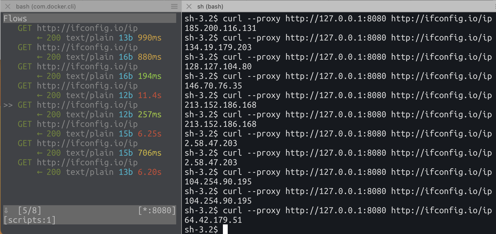

# WireGuard Rotator MITMProxy Addon + Standalone Docker

tl;dr: This is a WireGuard Rotator MITMProxy Addon + Standalone Docker.  It will rotate the WireGuard tunnel every n request. By default, n=3 and can be changed in the `dev.sh` file by setting the `max` environment variable. It is a proxy that will intercept all traffic and route it through an array of WireGuard tunnels. This is useful for penetration testing, scraping and privacy.

## Background
The popular repository [Ge0rg3/requests-ip-rotator](https://github.com/Ge0rg3/requests-ip-rotator) utilizes AWS API Gateway's large IP pool to rotate the IP addresses. This requires an AWS account and has shortcomings such as the header `X-Amzn-Trace-Id` that is set in every request and unexpected costs if `shutdown` commands fails and the AWS account is not monitored. 

## Tested providers
- AirVPN. Provides more than 240 different IP addresses

## Screenshot


# Installation

## Docker
1. Clone this repository
2. Execute `dev.sh` to build and start the docker image. You maybe want to change the `max` environment variable in the `dev.sh` file to the number of requests that should use the same IP address.
3. Use the proxy `http://127.0.0.1:8080`, for example in `requests`, `curl` or in **Burp Suite** as upstream proxy server. Both HTTP and HTTPS are supported.

### Build and run manually
```
docker build . -t wireguard-rotator
docker run --rm -it \
  -p 8080:8080 \
  -e max=3 \
  --name=wireguarddev \
  --cap-add=NET_ADMIN \
  --cap-add=SYS_MODULE \
  -v $(pwd)/conf/:/conf/ \
  --sysctl="net.ipv4.conf.all.src_valid_mark=1" \
  wireguard-rotator
```

## Without Docker
1. Clone this repository
2. Ensure that mitmproxy is installed on your system: `pip install mitmproxy` or `apt-get install -y mitmproxy`
3. Drop your WireGuard config files into the `conf` folder
4. Start the proxy: `mitmdump -s wireguard-rotator.py`

## Features
- Auto configuration: Drag and drop WireGuard config files to the /conf folder and you are ready to go.
- History: Remember the last used WireGuard configs and uses all other not used configs in a randomized round robin fashion.

## Future work
- Concurent wireguard connections for faster rotations
- Test additional VPN providers

## Disclaimer
This is a proof of concept and should not be used in production. It is not tested for security and stability. Use at your own risk.

## License
MIT License